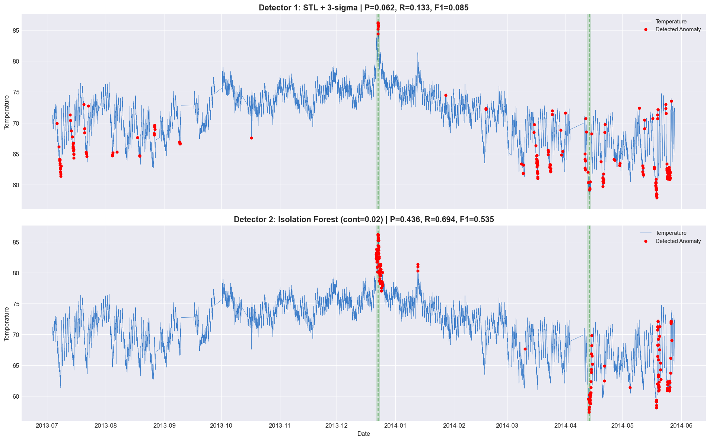
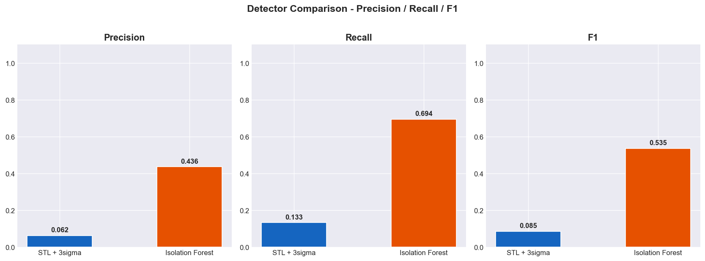

# W1-D1: Metric Anomaly Detection — Submission

## 1. Screenshots
**Kết quả Anomaly Detection (2 Detector)**

**Bảng so sánh Precision / Recall / F1**

## 2. Log Tuning (Output 3 lần tune)

**Tuning 1: Isolation Forest (Contamination = 0.01)**
- **Precision:** 0.6026
- **Recall:** 0.4796
- **F1 Score:** 0.5341

**Tuning 2: Isolation Forest (Contamination = 0.02)**
- **Precision:** 0.4359
- **Recall:** 0.6939
- **F1 Score:** 0.5354

**Tuning 3: Isolation Forest (Contamination = 0.05)**
- **Precision:** 0.2256
- **Recall:** 0.8980
- **F1 Score:** 0.3607

*=> Kết luận: Chọn contamination = 0.02 vì cho F1 cao nhất.*

*(Bổ sung thêm) Output 3 lần tune ngưỡng Threshold cho phương pháp STL:*
- Threshold = 2.5 -> Precision: 0.0627, Recall: 0.1939, F1: 0.0948
- Threshold = 3.0 -> Precision: 0.0625, Recall: 0.1327, F1: 0.0850
- Threshold = 3.5 -> Precision: 0.0507, Recall: 0.0714, F1: 0.0593

## 3. Model Artifacts
- File model đã train: `isolation_forest_model.pkl`
- Thuật toán: Isolation Forest
- Kích thước: < 1MB (đã tối ưu hóa tham số `n_estimators` và nén file)

## 4. Reflection (Đánh giá và Giải thích)

- **Dữ liệu thuộc loại gì?**
  Dữ liệu `ambient_temperature_system_failure.csv` đo nhiệt độ theo thời gian. Nó có tính chu kỳ (Seasonal) dao động theo ngày và đêm, và phân phối tổng thể khá tiệm cận phân phối chuẩn.

- **Chọn phương pháp nào và tại sao?**
  - **Detector 1 (Statistical):** Vì có chu kỳ nên Z-score bình thường sẽ thất bại. Tôi chọn STL Decomposition để loại bỏ yếu tố mùa vụ (ngày/đêm), sau đó chạy 3-Sigma trên phần residual còn lại để bắt các sai số đột biến.
  - **Detector 2 (ML):** Chọn Isolation Forest (cần Feature Engineering) vì phương pháp này có khả năng nhìn nhận sự kết hợp giữa nhiều bối cảnh cùng lúc (ví dụ: nhiệt độ lúc này so với trung bình 24h qua và tốc độ thay đổi).

- **Detector nào tốt hơn? (Trade-off & Production choice)**
  **Isolation Forest tốt hơn hẳn** trên dataset này (F1: 0.535 so với 0.085 của STL).
  
  *Vì sao STL thất bại nặng nề?*
  Dữ liệu cung cấp mô tả các đợt hỏng hóc hệ thống làm mát kéo dài trong nhiều ngày. Thuật toán STL khi bóc tách chu kỳ đã bị các đoạn nhiệt độ thay đổi từ từ (drift) "đánh lừa". Những đợt lỗi này kéo dài, làm thay đổi hẳn đường xu hướng (Trend). Kết quả là phần residual (dùng để đo 3-Sigma) lại trông có vẻ rất bình thường. STL chỉ giỏi bắt những đốm giật đột ngột (spike), không giỏi bắt các dải lỗi kéo dài.
  
  *Vì sao Isolation Forest thành công hơn hẳn?*
  Nhờ bước Feature Engineering! Việc thêm các feature như `rolling_mean_24h` và `lag_24` đã giúp Isolation Forest "nhận thức" được rằng toàn bộ dải giá trị trong những ngày hỏng hóc đó không giống với bối cảnh thông thường, giúp nó phát hiện lỗi mượt mà hơn.
  
  *Trade-off (Đánh đổi):*
  - STL: Nhanh, nhẹ, dễ giải thích nhưng miss lỗi nhiều.
  - IF: Cần build feature, chạy chậm hơn, khó giải thích hơn (black box) nhưng bắt lỗi phức tạp cực tốt.
  
  *Lựa chọn Production:*
  Với loại lỗi hệ thống biến đổi chậm và kéo dài như thế này, **Isolation Forest (với Feature pipeline chuẩn) hoàn toàn áp đảo**. Nếu muốn thiên về an toàn hệ thống (không bỏ lọt lỗi), đội vận hành có thể nâng `contamination` lên mức 0.05 (đạt Recall ~90%), chấp nhận xử lý thêm báo động giả (giảm Precision).
