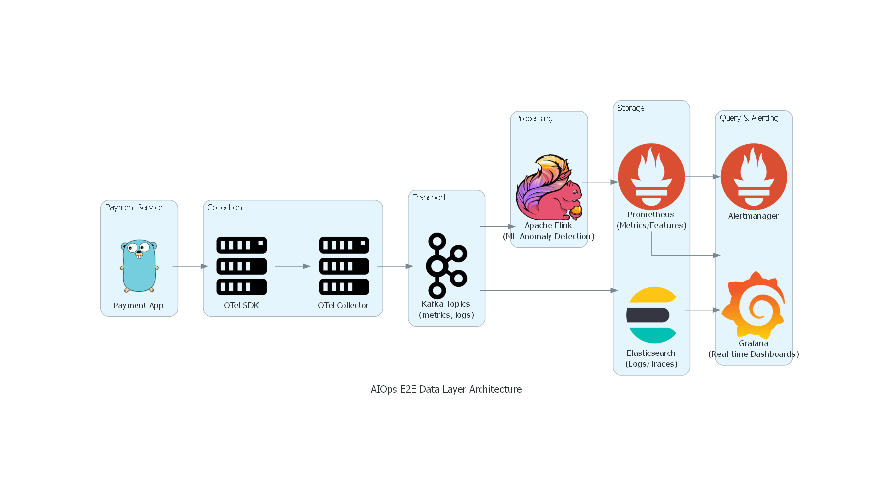

# Phase 4: SUBMIT - E2E Data Layer Architecture & Cost Estimation

## 1. Architecture Diagram


## 2. Cost Estimate
Dưới đây là bảng ước tính chi phí hàng tháng (USD) dựa trên cấu hình AWS (Build) và Datadog (Buy):

```text
=== Cost Estimation (Monthly, USD) ===
  Tier  Services  Build_Storage_Cost  Build_Compute_Cost  Build_Network_Cost  Build_Total_Cost  Datadog_Log_Cost  Datadog_Infra_Metric_Cost  Buy_Total_Cost
 Small        10                75.0               150.0              256.40            481.40             900.0                     1750.0          2650.0
Medium       100               750.0              1500.0             2563.99           4813.99            9000.0                    17500.0         26500.0
 Large      1000              7500.0             15000.0            25639.88          48139.88           90000.0                   175000.0        265000.0
```
*(Số liệu được generate bởi script `cost_model.py`)*

## 3. Tóm tắt ADR Decision (ADR-001)
- **Quyết định (Decision):** Lựa chọn **Self-hosted OSS** (OTel, Kafka, Flink, Prometheus, Elasticsearch) thay vì dùng Datadog SaaS cho hạ tầng quy mô tăng trưởng mạnh của hệ thống AIOps (10 -> 1000 services).
- **Lý do (Trade-offs):**
  - Giảm thiểu được chi phí ở scale lớn (Chi phí Build rẻ hơn Buy gần 10 lần ở quy mô Large).
  - Có sự linh hoạt tối đa để chạy các Machine Learning model đặc thù trên streaming data thông qua Apache Flink.
  - Chấp nhận đánh đổi thời gian time-to-market lâu hơn và cần đội ngũ chuyên biệt để quản trị hạ tầng (DevOps/Data Engineer).

## 4. Reflection: Build vs Buy cho Startup Series A (50 Services)
**Câu hỏi:** Nếu bạn được hire làm Platform Engineer cho startup 50-service vừa raise Series A, bạn sẽ recommend build hay buy? Tại sao?

**Câu trả lời:** Mình sẽ kiên quyết recommend **BUY (Mua giải pháp SaaS như Datadog)**.

**Lý do:**
1. **Tối ưu "Time to Market" và Sự Tập Trung:** Một startup vừa gọi xong Series A cần dồn 100% sức lực Engineering vào việc ship tính năng (Product features) để tìm kiếm và mở rộng Product-Market Fit. Việc bỏ ra 3 - 6 tháng của 1 đội ngũ senior engineer chỉ để setup và maintain hệ thống Kafka, Flink, Elasticsearch là sự lãng phí tài nguyên phát triển khổng lồ.
2. **Chi phí cơ hội (Opportunity Cost) và Vận hành:** Với hệ thống khoảng 50 services, ước tính chi phí Datadog rơi vào khoảng $10,000 - $15,000 / tháng. Startup Series A (thường gọi được $2M - $10M) hoàn toàn có ngân sách để chi trả mức này. Dùng tiền để mua lại "thời gian" và mua sự ổn định "Out-of-the-box" (chỉ cần cắm agent là có ngay metric, tracing, alert) là chiến lược hiệu quả nhất. Không phải đau đầu với các vấn đề vỡ ống Kafka hay Elasticsearch cluster bị đỏ.
3. **Chỉ Migrate khi thật sự cần tối ưu Gross Margin:** Khi công ty tiếp tục tăng trưởng mạnh (Series C, D, hoặc pre-IPO) đạt tới mức hàng ngàn services, lúc đó hoá đơn SaaS có thể lên đến hàng trăm ngàn USD mỗi tháng ảnh hưởng tới Gross Margin. Tới thời điểm đó, một team Platform vững mạnh được thành lập mới bắt đầu tiến hành "Build" dần để migrate.
