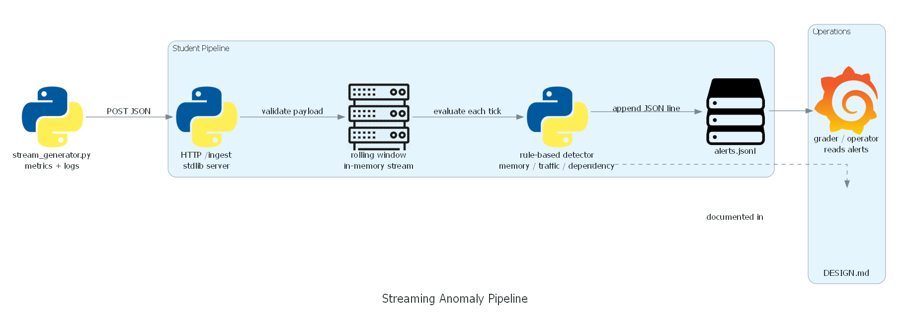

# Detection Approach - DESIGN.md

## Approach e dùng

Rule-based streaming detector với rolling state nhỏ trong memory. Pipeline nhận từng payload ở `/ingest`, đọc metrics và logs, sau đó so sánh với các ngưỡng báo thu được suy ra từ bảng normal range trong đề bài.

## Tại sao chọn approach này

Lab có baseline rõ ràng và chỉ có ba fault cần phân loại: `memory_leak`, `traffic_spike`, `dependency_timeout`. Rule-based detection phù hợp streaming vì xử lý từng event ngay khi đến, không cần train model, ít phụ thuộc thư viện, và dễ giải thích evidence trong alert.

## Cách hoạt động

Mỗi POST được validate JSON, lưu vào rolling window 120 điểm gần nhất, rồi chạy các rule theo thứ tự root cause. Dependency timeout được ưu tiên trước vì retry có thể làm tăng traffic và queue; traffic spike dùng RPS, queue depth và latency; memory leak dùng memory utilization, GC pause và log signal. Khi rule match, pipeline ghi một dòng JSON vào `alerts.jsonl`. Alert được deduplicate theo `type`; nếu cùng một type đã có warning thì chỉ ghi thêm khi severity tăng lên critical.

## Parameters 

- `memory_leak`: memory utilization >= 70% và GC pause >= 45ms, hoặc log có dấu hiệu OOM/GC pause. Critical khi utilization >= 80%, GC pause >= 100ms, hoặc có ERROR/FATAL log.
- `traffic_spike`: RPS >= 320, queue depth >= 40, p99 latency >= 180ms. Critical khi RPS >= 500, queue depth >= 120, hoặc 5xx >= 10%.
- `dependency_timeout`: upstream timeout >= 5%, 5xx >= 2%, p99 latency >= 180ms. Critical khi upstream timeout >= 20% hoặc 5xx >= 10%.
- Rolling history size = 120 datapoints để giữ context gần đây cho debug/stats mà không tốn bộ nhớ.

Các ngưỡng trên nằm xa vùng normal trong đề bài: memory bình thường khoảng 40%, RPS 80-160, queue 2-10, upstream timeout 0-0.4%. Vì vậy detector tránh alert sớm trước khi fault thật sự xảy ra.

## Pipeline / Architecture



```bash
python architecture_diagram.py
